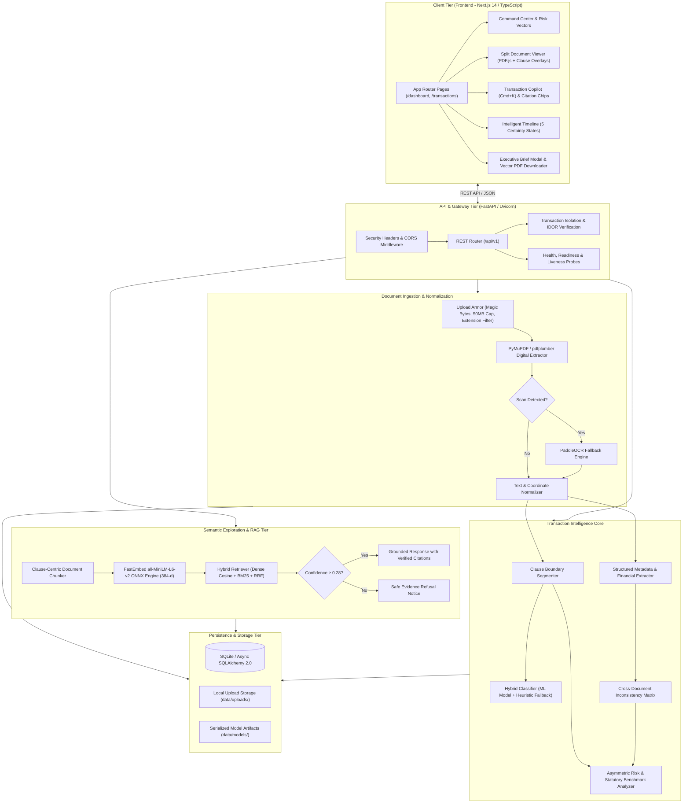

# ClauseGuard

> **AI-Powered Real-Estate Transaction Intelligence Platform**  
> *Cross-document verification, asymmetric risk analysis, grounded copilot, and discrepancy detection for property transactions.*

[](tests/backend)
[](frontend/tests)
[](PROJECT_PLAN.md)
[](docs/PHASE_9_MODEL_CARD.md)
[](LICENSE)

---

## Overview

**ClauseGuard** is an AI-powered transaction intelligence platform engineered specifically for real estate property purchases. Rather than treating legal contracts as isolated single-file documents, ClauseGuard ingests and analyzes an entire property transaction bundle together—correlating Builder-Buyer Agreements (BBAs), Allotment Letters, Payment Schedules, and Marketing Brochures.

The platform automatically extracts contractual clauses, quantifies financial exposure, checks statutory compliance against statutory real-estate benchmarks (such as RERA), identifies cross-document discrepancies, reconstructs a chronological transaction timeline, and powers a grounded AI Copilot that answers buyer inquiries with verifiable source citations.

> **Important Informational Notice**: ClauseGuard is an informational document-analysis and risk-detection system. It is designed to assist property buyers, conveyancers, and legal professionals in reviewing contract bundles. **ClauseGuard does not provide formal legal advice, representation, or legal opinions.** All outputs are informational indicators that require independent professional verification.

---

## Problem Statement

A real estate purchase is often the single largest financial transaction an individual or business makes. However, the documentation process is notoriously fragmented and legally asymmetric:

1. **Information Silos**: Buyers receive disparate documents across months—marketing brochures at launch, booking allotment letters upon deposit, 30–60 page fine-print agreements for signature, and separate milestone payment schedules.
2. **Hidden Inconsistencies**:
   - Advertised vs. Contractual Area: Sales literature advertises a 1,450 sq.ft carpet area, while Clause 4.2 of the agreement specifies 1,380 sq.ft with an allowable ±3% unilateral developer variance.
   - Delivery Date Slippage: Allotment letters promise handover by June 2027, but the agreement formalizes December 2027 plus a 180-day unilateral developer grace period.
   - Milestone Sum Mismatches: Installment schedule amounts do not sum correctly to the agreed total consideration.
3. **Contractual Asymmetries**: Standard developer agreements regularly impose steep default interest on buyers (e.g., 18% p.a. compounded monthly) while capping builder delay compensation to nominal sums (e.g., ₹5/sq.ft/month, equivalent to ~2.4% p.a.).
4. **Failure of Generic AI Tools**: Generic chat assistants and single-document summarizers evaluate one PDF in isolation. They are completely blind to contradictions between files, frequently hallucinate facts when legal text is ambiguous, and fail to provide verifiable audit trails.

**ClauseGuard solves this by treating the entire transaction as a unified intelligence graph.**

---

## Key Features

- **Multi-Document Ingestion & OCR Processing**: Digital extraction via PyMuPDF/pdfplumber with automated PaddleOCR fallback for scanned pages and layout coordinate preservation.
- **Clause Intelligence & Legal Classification**: Segments legal paragraphs and classifies them into an 11-category statutory taxonomy using an in-process local ML model with heuristic fallback.
- **Entity & Metadata Extraction**: Extracts carpet area, super area, base consideration, payment installment percentages, possession dates, and developer grace periods.
- **Cross-Document Verification**: Compares representations across documents to detect area shortfalls, timeline slippages, and payment schedule discrepancies.
- **Quantified Risk Analysis**: Calculates total financial risk exposure (e.g., excess earnest money forfeiture beyond statutory ceilings, asymmetric delay penalty burdens).
- **Audit Reports & Document Checklist**: Audits transaction completeness against mandatory statutory filings (Sanctioned Plans, NOCs, Occupancy Certificates) and exports structured PDF and JSON reports.
- **Grounded Transaction RAG**: Local FastEmbed 384-dimensional vector retrieval combined with BM25 lexical matching and Reciprocal Rank Fusion (RRF).
- **Anti-Hallucination Refusal Contract**: Explicitly refuses to speculate when textual evidence is absent in the transaction bundle.
- **Evidence Lineage (5-Tier Audit Trail)**: Every finding traces directly from `Document → Page Number → Clause Number → Statutory Benchmark → Quantified Exposure`.
- **Transaction Intelligence Copilot**: Interactive conversational assistant (`Cmd+K`) providing context-aware guidance with deep-linked citation chips.
- **Reconciled Multi-State Timeline**: Maps transaction dates across 5 certainty states (`CONTRACTUAL`, `INFERRED`, `MARKETING`, `CONFLICTING`, `UNCERTAIN`).
- **Executive Transaction Brief**: Generates an executive 7-section buyer brief with one-click vector PDF export.
- **Custom Transaction Support**: Allows users to create new transaction workspaces and upload user-provided documents with complete data isolation from demo bundles.
- **Production-Grade Security & Isolation**: Strict IDOR protection on all document and transaction routes, magic byte validation, 50MB upload caps, and security headers.

---

## How It Works

```
┌────────────────────────────────────────────────────────────────────────┐
│                     TRANSACTION DOCUMENT BUNDLE                        │
│  [Builder-Buyer Agreement] [Allotment Letter] [Brochure] [Schedule]    │
└───────────────────────────────────┬────────────────────────────────────┘
                                    │
                                    ▼
┌────────────────────────────────────────────────────────────────────────┐
│                   INGESTION & NORMALIZATION PIPELINE                   │
│   • Magic byte header verification (%PDF) & size validation (≤ 50MB)   │
│   • Digital text extraction (PyMuPDF / pdfplumber)                     │
│   • Scan density analysis & OCR fallback (PaddleOCR)                   │
│   • Coordinate bounding box mapping & layout normalization             │
└───────────────────────────────────┬────────────────────────────────────┘
                                    │
                                    ▼
┌────────────────────────────────────────────────────────────────────────┐
│                    CLAUSE & METADATA INTELLIGENCE                      │
│   • Regex boundary & legal numbering segmentation                      │
│   • 11-category statutory taxonomy classification                      │
│   • Local ML inference (all-MiniLM-L6-v2 ONNX + prototype manifold)    │
│   • Structured entity extraction (Area, Consideration, Dates, Penalties│
└───────────────────────────────────┬────────────────────────────────────┘
                                    │
                                    ▼
┌────────────────────────────────────────────────────────────────────────┐
│                   CROSS-DOCUMENT VERIFICATION MATRIX                   │
│   • Brochure vs Agreement carpet area discrepancy evaluation           │
│   • Allotment letter vs Agreement handover date reconciliation         │
│   • Payment installment schedule sum vs total consideration audit      │
└───────────────────────────────────┬────────────────────────────────────┘
                                    │
                                    ▼
┌────────────────────────────────────────────────────────────────────────┐
│                 RISK ENGINE & ASYMMETRIC QUANTIFICATION                │
│   • Statutory ceiling benchmarks (e.g. 10% earnest money limit)        │
│   • Reciprocal interest rate parity evaluation (RERA Section 18)       │
│   • Total quantified financial exposure computation (₹ Lakhs)          │
└───────────────────────────────────┬────────────────────────────────────┘
                                    │
                                    ▼
┌────────────────────────────────────────────────────────────────────────┐
│               GROUNDED RAG & TRANSACTION COPILOT (Cmd+K)               │
│   • 384-dimensional FastEmbed vector index in SQLite                   │
│   • Hybrid dense cosine + BM25 lexical retrieval (RRF ranking)         │
│   • Strict confidence gating (refuses if confidence < 0.28)            │
│   • Citation chips: Document → Page → Clause → Excerpt                 │
└───────────────────────────────────┬────────────────────────────────────┘
                                    │
                                    ▼
┌────────────────────────────────────────────────────────────────────────┐
│                      TRANSACTION COMMAND CENTER                        │
│   • Composite Health Score (0–100) & Financial Exposure Radar          │
│   • 5-State Chronological Timeline & Conflicting Date Alerts           │
│   • Interactive Split-Screen Document Viewer with Clause Overlays      │
│   • Executive Transaction Brief with Vector PDF Export                 │
└────────────────────────────────────────────────────────────────────────┘
```

---

## System Architecture



---

## AI & Machine Learning

ClauseGuard incorporates a multi-tier, defense-in-depth machine learning strategy built for high-stakes legal document evaluation:

### 1. Domain-Specific Statutory Corpus
Trained and calibrated on real Indian statutory property templates curated under Section 52(1)(q) of the Indian Copyright Act, 1957 (official state gazettes and RERA model agreements across Central MoHUA, Maharashtra, Karnataka, Haryana, Tamil Nadu, and Delhi NCT). PII is scrubbed using synthetic standardization tokens.

### 2. Multi-Candidate Model Bake-Off
Before production deployment, multiple candidate architectures were evaluated on an unseen holdout benchmark (`test.jsonl`, 59 samples from unseen legal templates):

| Model Architecture | Overall Accuracy | Macro Precision | Macro Recall | Macro F1 | Weighted F1 | Latency (CPU) | Artifact Size |
| :--- | :--- | :--- | :--- | :--- | :--- | :--- | :--- |
| **Heuristic Baseline** | 59.32% | 0.5413 | 0.6364 | 0.5720 | 0.5275 | 0.017 ms | Rules |
| **Candidate A (TF-IDF + Linear)** | 61.02% | 0.5520 | 0.5879 | 0.5682 | 0.5840 | 0.0003 ms | 45 KB |
| **Candidate B (Dense Embedding Head)** | 67.80% | 0.6124 | 0.6061 | 0.5684 | 0.6720 | 0.0005 ms | 18 KB |
| **Candidate C (Semantic Prototype)** | **89.83%** (53/59) | **0.8636** | **0.9091** | **0.8788** | **0.8644** | **0.030 ms** | **22 KB** |

*Candidate C delivered a +0.3068 Macro F1 improvement over the heuristic baseline and was selected as the production classifier.*

### 3. Hybrid Classification with Automatic Fallback
- **Primary Tier**: Evaluates text via `LocalClauseIntelligenceEngine` using 384-dimensional FastEmbed ONNX representations paired with a temperature-scaled ($T = 14.0$) prototype manifold.
- **Confidence Gate**: If prediction confidence is $\ge 0.60$, the ML classification is accepted with full probability distribution.
- **Fallback Tier**: If model files are absent, an exception occurs, or confidence falls below threshold, the classifier seamlessly defaults to deterministic statutory regex heuristics with complete explainability notes.

For detailed model cards, error matrices, and provenance manifests, see [`docs/PHASE_9_MODEL_CARD.md`](docs/PHASE_9_MODEL_CARD.md).

---

## RAG & Grounded Evidence

ClauseGuard’s Retrieval-Augmented Generation (RAG) system is engineered specifically to eliminate hallucination in contractual Q&A:

- **100% In-Process Local Embeddings**: Employs `sentence-transformers/all-MiniLM-L6-v2` via FastEmbed, producing 384-dimensional dense semantic vectors cached in SQLite. No documents or embeddings ever leave the local machine.
- **Hybrid Retrieval (Dense + Lexical + RRF)**: Combines semantic cosine similarity with BM25 keyword matching using Reciprocal Rank Fusion ($k=60$). This ensures exact clause numbers (e.g., *"Clause 11.2"*) and legal terms are retrieved alongside conceptual queries (e.g., *"When do I get my flat?"*).
- **Anti-Hallucination Threshold**: Retrieval scores are evaluated against a calibrated confidence gate ($0.28$). If relevant evidence is absent, the system explicitly refuses to guess, returning `status: "INSUFFICIENT_EVIDENCE"`.
- **Strict Evidence Lineage**: Substantive responses return structured citation chips with deep links to:
  `Document Name → Document ID → Page Number → Clause Number → Verified Text Excerpt`.
- **Cross-Bundle Isolation**: Vector searches explicitly include `where(DocumentChunk.bundle_id == bundle_id)`, strictly preventing semantic search from leaking text between transactions.

---

## Transaction Intelligence Copilot

The Copilot is an evidence-grounded transaction assistant accessible globally via `Cmd+K`:

- **Context-Aware Assistance**: Answers complex questions regarding delivery timelines, milestone payments, area tolerances, and cancellation penalties.
- **Explainable Risk Intelligence**: Dissects complex risks into 5-tier audit cards showing the root clause, statutory RERA benchmark, and quantified financial consequence.
- **Interactive Multi-State Timeline**: Visualizes chronological milestones categorized into 5 certainty states (`CONTRACTUAL`, `INFERRED`, `MARKETING`, `CONFLICTING`, `UNCERTAIN`) and alerts users to date clashes.
- **Executive Transaction Brief**: Compiles a 7-section buyer advisory memorandum (Property Details, Financial Exposure, Critical Discrepancies, Risk Vectors, Key Milestones, Missing Documentation, Recommended Actions) with instant vector PDF download.

---

## Technology Stack

| Layer | Technologies |
| :--- | :--- |
| **Frontend** | Next.js 14 (App Router), React 18, TypeScript, Tailwind CSS, Lucide React, PDF.js |
| **Backend** | FastAPI, Python 3.9+, Pydantic v2, Starlette, Uvicorn, asyncio |
| **Database & ORM** | SQLite with async SQLAlchemy 2.0 (`aiosqlite`), parameterized queries |
| **AI / ML & NLP** | FastEmbed (`all-MiniLM-L6-v2` ONNX), ONNX Runtime, NumPy, scikit-learn |
| **Document Processing** | PyMuPDF (`fitz`), pdfplumber, PaddleOCR, Pillow, ReportLab |
| **Testing Harness** | pytest, pytest-asyncio, pytest-mock, httpx, Node.js Test Runner (`node --test`) |
| **DevOps & Environment** | bash, zsh, Git, npm, virtualenv, POSIX process management |

---

## Demonstration Transactions

### 1. SkyView Residency — Flat A-1204 (`skyview-a1204`)
> *Demo transaction using synthetic / example project data.*

The application comes pre-loaded with the comprehensive SkyView demo bundle:
- **Project**: SkyView Residency, Sector 62, Golf Course Ext., Gurgaon, HR
- **Unit**: Flat A-1204 (12th Floor, Tower A) | **Price**: ₹1,42,50,000
- **Pre-Loaded Documents (4)**: Builder-Buyer Agreement (38 pages), Allotment Letter, Payment Schedule, Marketing Brochure.
- **Detected Discrepancies**: 70 sq.ft carpet area shortfall (₹10.35L impact), 12-month delivery date shift, milestone installment sum mismatch.
- **Health Score**: 74 / 100 with ₹25.65 Lakh quantified total financial risk exposure.

### 2. Custom Transaction Support (`Test Residency — Flat B-204`)
ClauseGuard fully supports user-created transactions and custom document uploads, as verified in regression testing:
- **Project**: Test Residency, Flat B-204 | **City**: Hyderabad, Telangana
- **Developer**: Test Developers Pvt. Ltd. | **Consideration**: ₹75,00,000
- **Uploaded Document**: Custom single PDF agreement (`ClauseGuard_Test_Transaction_Agreement.pdf`).
- **Verified Isolation**: Custom transaction isolates its document, extracts 7 clauses, processes risk metrics, and renders cleanly with zero leakage of SkyView demo data.

---

## Screenshots

Interface screenshots and visual captures are cataloged in [`docs/screenshots/`](docs/screenshots/README.md).

Key views documented:
1. `01_landing_page.png` — Dark-mode landing page with value proposition
2. `02_command_center.png` — Composite Health Score & Quantified Exposure Radar
3. `03_cross_document_discrepancies.png` — Side-by-side area and timeline contradiction cards
4. `04_transaction_copilot.png` — Interactive Copilot drawer with citation chips
5. `05_explainable_risk_lineage.png` — 5-tier statutory provenance drawer
6. `06_intelligent_timeline.png` — 5-state chronological milestone tracker
7. `07_split_document_viewer.png` — Synchronized PDF.js viewer with clause highlights
8. `08_model_diagnostics_hub.png` — ML bake-off benchmarks & interactive sandbox
9. `09_executive_transaction_brief.png` — 7-section buyer brief with PDF export
10. `10_custom_transaction_workflow.png` — Dynamic custom transaction workspace

*(Screenshots can be added or updated directly in `docs/screenshots/` without code changes).*

---

## Testing & Quality Assurance

ClauseGuard is backed by automated regression test suites covering backend endpoints, ML classification, RAG retrieval, security isolation, and frontend UI components.

### Latest Verified Test Results

| Test Suite | Framework | Passing / Total | Duration | Status |
| :--- | :--- | :--- | :--- | :--- |
| **Backend Integration & Security** | pytest 8.4.2 / Python 3.9 | **91 / 91** | 2.56s | **100% Passed** |
| **Frontend Integration & UI** | Node.js Test Runner | **39 / 39** (6 suites) | 115.8ms | **100% Passed** |
| **Production Build Compilation** | Next.js 14.2.24 | **11 / 11 Pages** | 12.0s | **✓ Compiled** |
| **Transaction Isolation (IDOR)** | Automated HTTP Tests | Verified 404 | — | **Passed** |
| **Custom Transaction Pipeline** | Manual + Automated | Verified Clean | — | **Passed** |

### Run Backend Tests
```bash
./backend/.venv/bin/pytest tests/backend -v
```

### Run Frontend Tests
```bash
cd frontend && npm test
```

### Run Production Build
```bash
cd frontend && npm run build
```

---

## Security & Privacy Architecture

> *Security checks were performed for the tested project scope.*

- **Upload Armor**: Enforces a 50 MB file size limit (`HTTP 413`), restricts extensions to `.pdf`, `.png`, `.jpg`, `.jpeg`, validates `%PDF` magic bytes, and rejects 0-byte uploads.
- **Path Traversal Defense**: Filenames are sanitized via `Path(filename).name` (stripping `../` paths) and prefixed with content SHA-256 hashes.
- **Multi-Tenant / Bundle Isolation (IDOR Defense)**: Every database query, clause fetch, metadata inspection, and vector chunk search is scoped strictly by `bundle_id == transaction_id`. Foreign document requests return `HTTP 404 Not Found`.
- **SQL Injection Defense**: 100% of database interactions use async SQLAlchemy 2.0 parameterized queries with zero string concatenation.
- **Hardened HTTP Headers**: Global middleware enforces `X-Content-Type-Options: nosniff`, `X-Frame-Options: DENY`, `X-XSS-Protection: 1; mode=block`, and strict referrer policies.
- **Local AI Privacy**: Embeddings and ML inference run entirely within the local Python process on CPU. Confidential contracts and personal details are never transmitted to external AI APIs.
- **Zero Committed Secrets**: `.gitignore` strictly excludes `.env`, private keys, local databases (`*.db`), and uploaded files (`data/uploads/*`).

For full details, see [`docs/SECURITY_AUDIT.md`](docs/SECURITY_AUDIT.md).

---

## Local Setup

### Prerequisites
- **Python**: 3.9+ (Python 3.11 recommended)
- **Node.js**: 18+ (Node 20 recommended)
- **Git**

### 1. Unified Launcher (Fastest)
```bash
git clone <repository-url>
cd ClauseGuard

# Launch both backend and frontend servers
chmod +x scripts/run_clauseguard.sh
./scripts/run_clauseguard.sh
```

### 2. Manual Step-by-Step Setup

#### Backend Setup
```bash
cd backend

# Create and activate virtual environment
python3 -m venv .venv
source .venv/bin/activate  # Windows: .venv\Scripts\activate

# Install dependencies
pip install -r requirements.txt

# Start FastAPI server on port 8000
uvicorn app.main:app --host 127.0.0.1 --port 8000
```

#### Frontend Setup
```bash
cd frontend

# Install Node dependencies
npm install

# Build production bundle
npm run build

# Start Next.js production server on port 3000
npm start -- -p 3000
```

### Application URLs
- **Web Application**: [`http://localhost:3000`](http://localhost:3000)
- **SkyView Demo Bundle**: [`http://localhost:3000/dashboard/transactions/skyview-a1204`](http://localhost:3000/dashboard/transactions/skyview-a1204)
- **FastAPI Backend Root**: [`http://127.0.0.1:8000`](http://127.0.0.1:8000)
- **Interactive Swagger Docs**: [`http://127.0.0.1:8000/docs`](http://127.0.0.1:8000/docs)
- **Liveness Probe**: [`http://127.0.0.1:8000/api/v1/health/live`](http://127.0.0.1:8000/api/v1/health/live)
- **Readiness Probe**: [`http://127.0.0.1:8000/api/v1/health/ready`](http://127.0.0.1:8000/api/v1/health/ready)

---

## Demo Workflow (Golden Path)

To experience the complete platform in under 5 minutes:

1. **Landing Page (`http://localhost:3000`)**: Review value proposition and click **"Launch Platform"**.
2. **Dashboard (`/dashboard`)**: Inspect portfolio bundles. Note the **SkyView Residency (Flat A-1204)** card (Health: 74/100, ₹25.65L exposure). Click into the card.
3. **Command Center**: Review the Financial Exposure breakdown, statutory benchmark comparisons, and Priority Action items.
4. **Transaction Copilot (`Cmd+K`)**: Open the Copilot drawer. Click the prompt *"Explain the delay penalty discrepancy"* to view the grounded answer citing Clause 5.3 vs Clause 8.2 with citation chips.
5. **Anti-Hallucination Test**: Inquire about an unmentioned topic (e.g., *"What is the builder's stock price?"*) and observe the strict evidence refusal.
6. **Cross-Document Inconsistencies**: Open the **Inconsistencies** tab to view the side-by-side comparison of 1,450 sq.ft (Brochure) vs. 1,380 sq.ft (BBA).
7. **Intelligent Timeline**: Click the **Timeline** tab to review dates organized across 5 certainty states with conflicting date alerts.
8. **Split Analysis Workspace (`/analysis`)**: Open the split viewer to inspect clauses with bounding box overlays and ML Confidence Badges.
9. **Model Diagnostics Hub (`/dashboard/settings`)**: View the 3-model benchmark bake-off table and test predictions in the interactive sandbox.
10. **Executive Brief**: Click **"Generate Brief"** to review the 7-section structured memorandum and export a vector PDF.
11. **Custom Transaction Creation (`/transactions/new`)**: Create a new transaction workspace (e.g. *Test Residency — Flat B-204*), upload a custom PDF, and verify isolated single-document analysis.

---

## Limitations

- **Informational Scope Only**: ClauseGuard does not provide legal advice, legal representation, or formal opinions. All outputs require independent verification by qualified legal counsel.
- **Jurisdictional Training Focus**: Current ML models and statutory rules are optimized for Indian real estate regulations (RERA Acts and standard state templates). Commercial leases, international jurisdictions, and non-real-estate contracts are out of scope.
- **OCR Quality Dependency**: Low-resolution, skewed, or degraded photocopies may require manual verification or higher-resolution rescans.
- **Self-Hosted Deployment Target**: Designed primarily for local workstation and dedicated self-hosted environments.

---

## Future Scope

- **Multi-Tenant Cloud Authentication**: Role-based access control (RBAC) with organization-level team sharing and OAuth2 integration.
- **PostgreSQL + pgvector Integration**: Scalable enterprise vector storage backend for hundreds of concurrent transactions.
- **Multi-Lingual OCR & Translation**: Support for regional Indian languages (Hindi, Telugu, Kannada, Marathi, Tamil) frequently present in land title deeds and municipal encumbrance certificates.
- **State RERA Portal Integration**: Direct API lookup of promoter project registrations, litigation records, and quarterly progress reports from state regulatory portals.

---

## Project Status

ClauseGuard is **feature-complete** and verified across all 12 planned phases. The core ingestion, OCR fallback, cross-document verification engine, local ML classifier, grounded RAG copilot, and Next.js frontend are fully operational.

---

## Author

- **Author**: Bhaasvanth
- **Email**: `gattubhaasvanth@gmail.com`
- **Focus**: AI-Powered Legal & Financial Intelligence, Cross-Document Verification, Local Explainable NLP.

---

## License

This project is licensed under the **MIT License**. See the [`LICENSE`](LICENSE) file for details.
