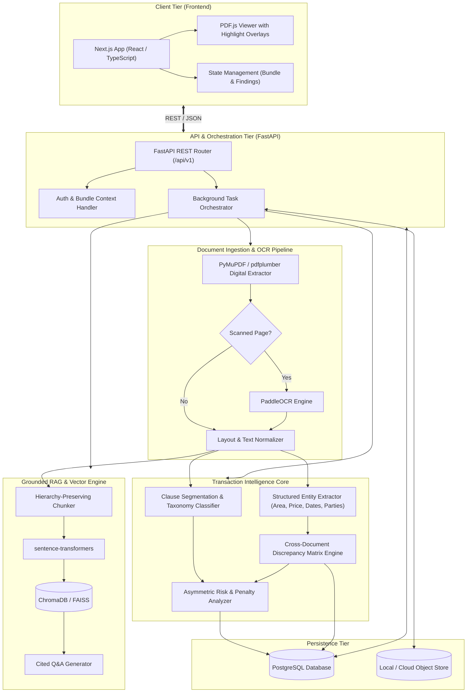
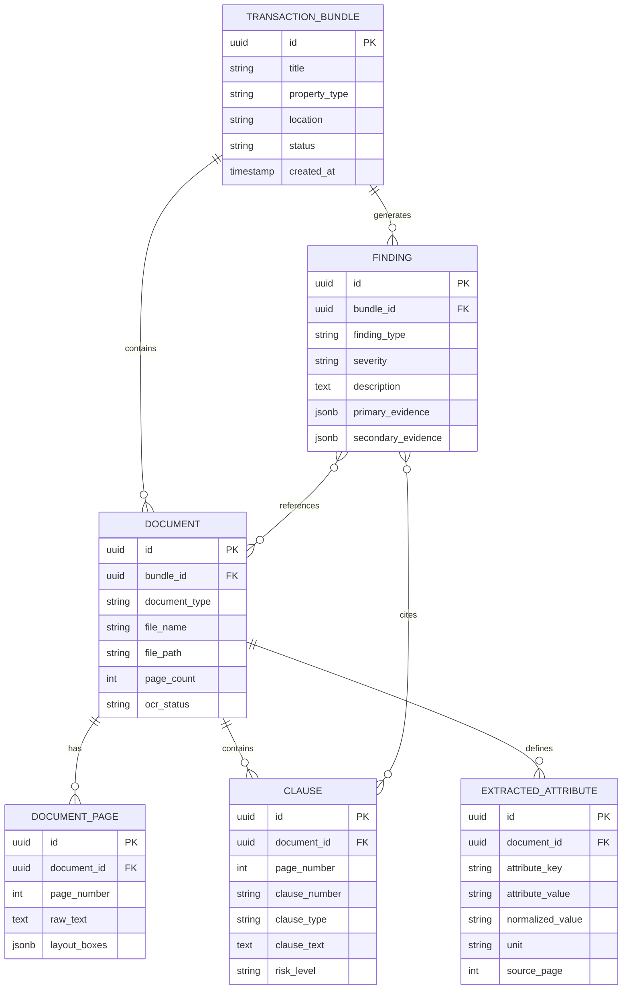

# ClauseGuard System Architecture

## 1. Architectural Philosophy

ClauseGuard is architected from the ground up to solve a fundamental limitation of current legal-tech tools: **cross-document inconsistency blindness**. Rather than treating single PDF files as isolated silos for summarization, ClauseGuard organizes data around **Transactions** and their associated **Document Bundles**.

### Core Tenets

1. **Transaction-Centric, Not File-Centric**: Every document belongs to a parent `TransactionBundle`. Consistency and risk are evaluated across the entire bundle.
2. **Evidence-Linked Audit Trail**: Findings must never exist in the abstract. Every finding maintains a cryptographic or deterministic link: `Document -> Page -> Bounding Box / Clause -> Raw Excerpt`.
3. **Calibrated Informational Positioning**: ClauseGuard is an informational verification tool. Architectural boundaries prevent the system from generating definitive legal declarations. Findings are labeled as *"Potential inconsistency detected"*, *"Potential risk"*, or *"Requires verification"*.
4. **Provider-Agnostic LLM Layer**: The AI engine is decoupled from any single proprietary LLM provider via an abstract interface, allowing seamless switching between Google Gemini, Anthropic, OpenAI, or local models.
5. **Deterministic Rules Combined with Semantic AI**: High-risk real-estate metrics (carpet area, penalty percentages, payment milestones, completion dates) are extracted into normalized schemas and compared using deterministic logic first, supplemented by semantic NLP for contextual ambiguity.

---

## 2. High-Level Architecture Diagram

---

## 3. Component Breakdown

### 3.1 Frontend Layer (`frontend/`)
- **Technology**: Next.js (App Router), TypeScript, Tailwind CSS, `shadcn/ui`, Framer Motion.
- **Key Modules**:
  - **Transaction Workspace**: Upload manager where users group related documents (brochure, allotment letter, sale agreement, payment schedule) into a single transaction file.
  - **Synchronized Split Viewer**: Displays the source PDF via `PDF.js` on one side and the ClauseGuard Analysis Tree on the other.
  - **Inconsistency Inspector**: Clicking on any cross-document discrepancy (e.g. area mismatch) triggers a split-view highlighting the exact text snippet on both documents simultaneously.

### 3.2 Backend Service Layer (`backend/`)
- **Technology**: Python 3.11+, FastAPI, Pydantic v2, `asyncpg`, SQLAlchemy 2.0.
- **Key Responsibilities**:
  - Expose validated REST endpoints for bundles, document uploads, analysis progress, and findings retrieval.
  - Dispatch document extraction and analysis jobs to background workers.
  - Maintain data consistency across relational transactions and vector embeddings.

### 3.3 Document Processing & OCR Pipeline
- **Hybrid Extraction Flow**:
  1. **Direct Digital Extraction**: Documents are first parsed using PyMuPDF (`fitz`) to extract text characters and bounding-box coordinates with maximum speed and zero loss.
  2. **Page-Level Density & Scan Detection**: Text density and image ratios are evaluated per page.
  3. **OCR Fallback**: If a page is scanned, handwritten, or stamped legal paper with low text density, the page is routed through `PaddleOCR` to recover text and bounding coordinates.
  4. **Structure Preservation**: Table boundaries (crucial for payment schedules and area schedules) are reconstructed into tabular structures rather than flattened strings.

### 3.4 Transaction Intelligence & Discrepancy Engine
- **Structured Attribute Graph**:
  Each document in a bundle is processed to yield a normalized attribute vector:
  $$\text{DocAttr} = \{\text{CarpetArea}, \text{SuperArea}, \text{TotalPrice}, \text{PossessionDate}, \text{GracePeriod}, \text{DelayInterestRate}, \dots\}$$
- **Discrepancy Matrix Evaluator**:
  A deterministic comparison matrix cross-evaluates attributes across document pairs:
  $$\Delta(\text{Doc}_A, \text{Doc}_B) = \begin{cases} \text{MISMATCH}, & \text{if } |\text{Attr}_A - \text{Attr}_B| > \epsilon \\ \text{CONSISTENT}, & \text{otherwise} \end{cases}$$
- **Evidence Linking**:
  When a mismatch is identified, the system creates a `Finding` record containing:
  - `DiscrepancyType`: e.g. `AREA_MISMATCH`
  - `SourceDocA`: Document ID, Page Number, Clause Header, Exact Text Quote, Bounding Box
  - `SourceDocB`: Document ID, Page Number, Clause Header, Exact Text Quote, Bounding Box
  - `Severity`: Informational / Moderate / Critical
  - `UserMessage`: *"Brochure advertises 1,450 sq.ft carpet area, while Sale Agreement stipulates 1,380 sq.ft. Requires verification."*

### 3.5 Grounded RAG & Semantic Exploration
- **Chunking Strategy**: Document chunks retain document ID, page number, and clause heading metadata in their vector payload.
- **Embeddings**: Local, performant sentence-transformers (`all-MiniLM-L6-v2` or `bge-small-en-v1.5`) run in-process or via lightweight vector services.
- **Vector Storage**: ChromaDB (embedded/persistent) or FAISS.
- **Strict Grounding Guardrail**: Prompts are constrained to answer strictly from retrieved transaction excerpts, accompanied by clickable citation chips linking back to the document viewer.

---

## 4. Relational Data Model (PostgreSQL)

---

## 5. Security, Privacy & Data Compliance

1. **Local & Ephemeral Processing**: During local development, all files remain within `data/uploads/` and are never transmitted to third parties without explicit user configuration.
2. **PII Masking Pipeline**: Sensitive personal identification data (Aadhaar, PAN numbers, banking account numbers) can be masked prior to LLM submission.
3. **No Training on Customer Data**: External LLM providers are accessed solely via standard enterprise APIs with zero-data-retention guarantees.
