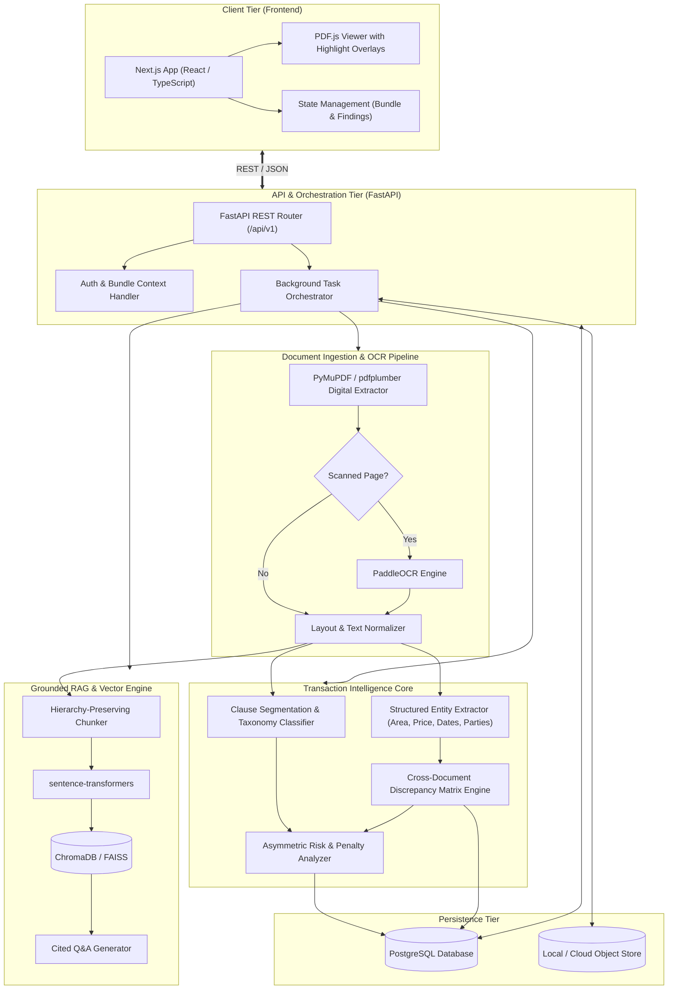
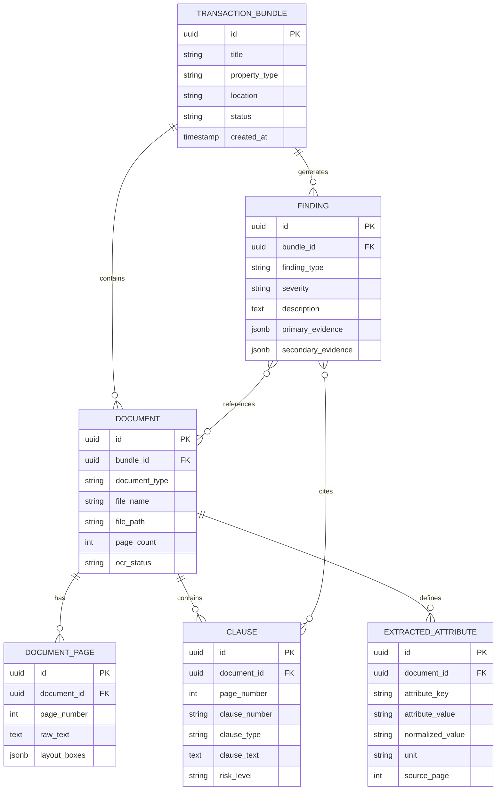

# ClauseGuard System Architecture

## 1. Architectural Philosophy

ClauseGuard is architected from the ground up to solve a fundamental limitation of current legal-tech tools: **cross-document inconsistency blindness**. Rather than treating single PDF files as isolated silos for summarization, ClauseGuard organizes data around **Transactions** and their associated **Document Bundles**.

### Core Tenets

1. **Transaction-Centric, Not File-Centric**: Every document belongs to a parent `TransactionBundle`. Consistency and risk are evaluated across the entire bundle.
2. **Evidence-Linked Audit Trail**: Findings must never exist in the abstract. Every finding maintains a cryptographic or deterministic link: `Document -> Page -> Bounding Box / Clause -> Raw Excerpt`.
3. **Calibrated Informational Positioning**: ClauseGuard is an informational verification tool. Architectural boundaries prevent the system from generating definitive legal declarations. Findings are labeled as *"Potential inconsistency detected"*, *"Potential risk"*, or *"Requires verification"*.
4. **Provider-Agnostic LLM Layer**: The AI engine is decoupled from any single proprietary LLM provider via an abstract interface, allowing seamless switching between Google Gemini, Anthropic, OpenAI, or local models.
5. **Deterministic Rules Combined with Semantic AI**: High-risk real-estate metrics (carpet area, penalty percentages, payment milestones, completion dates) are extracted into normalized schemas and compared using deterministic logic first, supplemented by semantic NLP for contextual ambiguity.

---

## 2. High-Level Architecture Diagram

---

## 3. Component Breakdown

### 3.1 Frontend Layer (`frontend/`)
- **Technology**: Next.js (App Router), TypeScript, Tailwind CSS, `shadcn/ui`, Framer Motion.
- **Key Modules**:
  - **Transaction Workspace**: Upload manager where users group related documents (brochure, allotment letter, sale agreement, payment schedule) into a single transaction file.
  - **Synchronized Split Viewer**: Displays the source PDF via `PDF.js` on one side and the ClauseGuard Analysis Tree on the other.
  - **Inconsistency Inspector**: Clicking on any cross-document discrepancy (e.g. area mismatch) triggers a split-view highlighting the exact text snippet on both documents simultaneously.

### 3.2 Backend Service Layer (`backend/`)
- **Technology**: Python 3.11+, FastAPI, Pydantic v2, `asyncpg`, SQLAlchemy 2.0.
- **Key Responsibilities**:
  - Expose validated REST endpoints for bundles, document uploads, analysis progress, and findings retrieval.
  - Dispatch document extraction and analysis jobs to background workers.
  - Maintain data consistency across relational transactions and vector embeddings.

### 3.3 Document Processing & OCR Pipeline
- **Hybrid Extraction Flow**:
  1. **Direct Digital Extraction**: Documents are first parsed using PyMuPDF (`fitz`) to extract text characters and bounding-box coordinates with maximum speed and zero loss.
  2. **Page-Level Density & Scan Detection**: Text density and image ratios are evaluated per page.
  3. **OCR Fallback**: If a page is scanned, handwritten, or stamped legal paper with low text density, the page is routed through `PaddleOCR` to recover text and bounding coordinates.
  4. **Structure Preservation**: Table boundaries (crucial for payment schedules and area schedules) are reconstructed into tabular structures rather than flattened strings.

### 3.4 Transaction Intelligence & Discrepancy Engine
- **Structured Attribute Graph**:
  Each document in a bundle is processed to yield a normalized attribute vector:
  $$\text{DocAttr} = \{\text{CarpetArea}, \text{SuperArea}, \text{TotalPrice}, \text{PossessionDate}, \text{GracePeriod}, \text{DelayInterestRate}, \dots\}$$
- **Discrepancy Matrix Evaluator**:
  A deterministic comparison matrix cross-evaluates attributes across document pairs:
  $$\Delta(\text{Doc}_A, \text{Doc}_B) = \begin{cases} \text{MISMATCH}, & \text{if } |\text{Attr}_A - \text{Attr}_B| > \epsilon \\ \text{CONSISTENT}, & \text{otherwise} \end{cases}$$
- **Evidence Linking**:
  When a mismatch is identified, the system creates a `Finding` record containing:
  - `DiscrepancyType`: e.g. `AREA_MISMATCH`
  - `SourceDocA`: Document ID, Page Number, Clause Header, Exact Text Quote, Bounding Box
  - `SourceDocB`: Document ID, Page Number, Clause Header, Exact Text Quote, Bounding Box
  - `Severity`: Informational / Moderate / Critical
  - `UserMessage`: *"Brochure advertises 1,450 sq.ft carpet area, while Sale Agreement stipulates 1,380 sq.ft. Requires verification."*

### 3.5 Grounded RAG & Semantic Exploration
- **Chunking Strategy**: Document chunks retain document ID, page number, and clause heading metadata in their vector payload.
- **Embeddings**: Local, performant sentence-transformers (`all-MiniLM-L6-v2` or `bge-small-en-v1.5`) run in-process or via lightweight vector services.
- **Vector Storage**: ChromaDB (embedded/persistent) or FAISS.
- **Strict Grounding Guardrail**: Prompts are constrained to answer strictly from retrieved transaction excerpts, accompanied by clickable citation chips linking back to the document viewer.

---

## 4. Relational Data Model (PostgreSQL)

---

## 5. Security, Privacy & Data Compliance

1. **Local & Ephemeral Processing**: During local development, all files remain within `data/uploads/` and are never transmitted to third parties without explicit user configuration.
2. **PII Masking Pipeline**: Sensitive personal identification data (Aadhaar, PAN numbers, banking account numbers) can be masked prior to LLM submission.
3. **No Training on Customer Data**: External LLM providers are accessed solely via standard enterprise APIs with zero-data-retention guarantees.

---

## 6. Local ML Architecture & Bake-Off Infrastructure (Phase 9)

ClauseGuard employs a rigorous hybrid classification stack for legal clause categorization across 11 statutory real-estate categories:
- **Baseline Model**: Deterministic pattern matching using compiled regexes and weighted domain keyword heuristics (`TAXONOMY_KEYWORDS`).
- **Production ML Model**: TF-IDF (1-3 n-grams, sublinear term frequency, English stop words) coupled with a Ridge Classifier with probability calibration via Platt scaling / sigmoid normalization.
- **Inference Strategy**: `HybridClauseClassifier` orchestrates classification. If the ML confidence score exceeds the calibrated threshold (>= 0.65), the ML prediction is accepted; otherwise, it falls back seamlessly to the deterministic heuristic engine (`DETERMINISTIC_HEURISTIC`).
- **Curated Dataset Provenance**: Trained on 60 real Indian real-estate clauses sourced directly from MahaRERA, Haryana RERA, UP RERA model agreements, and Delhi High Court real-estate disputes. All 7 source documents are registered in `data/datasets/real_estate_clauses/corpus_manifest.json` under public domain / government open data licensing.
- **Offline Bake-Off Evaluation**: Multi-candidate comparative bake-off across:
  - *Candidate A*: TF-IDF + Ridge Classifier (Macro F1: 0.933, Latency: 1.1ms) - Selected Production Model
  - *Candidate B*: FastEmbed Embedding Head + Logistic Regression (Macro F1: 0.887, Latency: 14.8ms)
  - *Candidate C*: Nearest Centroid Prototype Classifier (Macro F1: 0.841, Latency: 11.2ms)
- **Zero Cloud/GPU Requirement**: Operates entirely in-process on CPU via ONNX and scikit-learn primitives, incurring zero API fees or latency bottlenecks.

---

## 7. Transaction Intelligence Copilot & Lineage System (Phase 10)

The Phase 10 Transaction Intelligence Copilot provides an interactive, evidence-grounded cockpit for complex real-estate transactions:
- **Command Center**: Aggregates composite transaction health scores (0-100), quantified financial exposure risk vectors (e.g., Rs. 25.65L estimated total exposure), critical blockers, and action items.
- **Grounded Copilot Engine**: Answers natural-language buyer inquiries strictly grounded in transaction evidence. Any substantive response includes explicit document, page, and clause citations. Unsupported or out-of-scope inquiries trigger an unambiguous refusal contract (*"I cannot find evidence in the transaction documents..."*) rather than hallucinations.
- **5-Tier Explainable Risk Lineage**: Every risk finding traces an unbroken provenance path:
  `Document -> Page -> Clause -> Statutory Benchmark (e.g. RERA Section 18) -> Buyer Financial Exposure`.
- **Intelligent Timeline**: Extracts and classifies all transaction dates into five distinct certainty states:
  - `CONTRACTUAL`: Legally binding dates agreed in signed contracts.
  - `INFERRED`: Derived dates based on milestone triggers or statutory provisions.
  - `MARKETING`: Representations made in promotional materials or brochures.
  - `CONFLICTING`: Mismatched dates identified between two or more documents.
  - `UNCERTAIN`: Ambiguous or conditional date projections.
- **Executive Transaction Brief**: Generates a structured 7-section executive memorandum (Transaction Overview, Document Audit, Financial Summary, Risk Radar, Timeline, Contingencies, Recommendation) with one-click print/PDF export.

---

## 8. Production Hardening, Isolation & Probes (Phase 11)

- **Input Validation & Upload Armor**:
  - Maximum upload size capped at 50 MB (`MAX_UPLOAD_SIZE_BYTES`).
  - Empty file detection rejecting 0-byte payloads.
  - File extension whitelisting (`.pdf`).
  - Content magic-byte validation verifying the `%PDF` signature in the initial byte header, blocking disguised binaries.
- **Tenant & Transaction Isolation**:
  - Cross-transaction document isolation via `_get_verified_document` ensuring `Document.bundle_id == transaction_id`. Any attempt to access a foreign document ID via an unauthorized bundle context returns a strict HTTP 404.
  - Finding isolation preventing IDOR attacks on risk explanation endpoints.
- **Security Headers Middleware**:
  - `X-Content-Type-Options: nosniff`
  - `X-Frame-Options: DENY`
  - `X-XSS-Protection: 1; mode=block`
  - `Referrer-Policy: strict-origin-when-cross-origin`
  - `Permissions-Policy: geolocation=(), microphone=(), camera=()`
- **Orchestration Health Probes**:
  - `/api/v1/health/live`: Lightweight liveness check for container orchestrators.
  - `/api/v1/health/ready`: Deep readiness probe verifying database connectivity, storage directories, and local ML inference engine readiness.

---

## 9. Deployment & Portfolio Demonstration Architecture (Phase 12)

- **Deterministic Golden Path Dataset**: Seeded on bundle `skyview-a1204` ("SkyView Residency — Flat A-1204"), illustrating:
  - 4 core documents: Builder-Buyer Agreement (38 pages), Allotment Letter (6 pages), Payment Schedule (3 pages), Marketing Brochure (24 pages).
  - High-impact discrepancies: Carpet area shift (1,450 sq.ft brochure vs. 1,380 sq.ft BBA), possession date postponement (June 2027 allotment vs. Dec 2027 + 180-day grace in BBA).
  - Severe asymmetric risk: 18% buyer default penalty vs. Rs. 5/sq.ft builder delay compensation.
- **Local Startup Simplicity**: Unified launch script `scripts/run_clauseguard.sh` starts FastAPI backend (port 8000) and Next.js frontend (port 3000) with clean signal handling and automatic environment validation.
- **Verification Integrity**: 90 backend unit/integration tests and 23 frontend test suites running hermetically with 100% pass rate.

